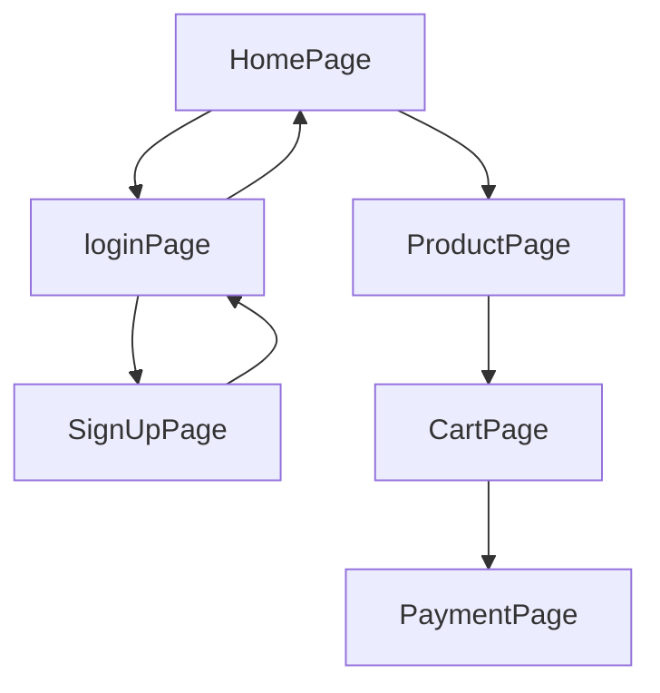

# Clone of Bluemercury.com

Bluemercury.com is a leading luxury beauty retailer offering the best cosmetics, skin care, makeup, perfume, hair, and bath and body.
It is a chain of American beauty stores founded in 1999 by Marla Malcolm Beck and Barry Beck in Georgetown, Washington, D.C. The stores sell cosmetics, as well as in-store facials and spa treatments.


## Installation

```
$ git clone https://github.com/Sandipmaury/affable-scissors-7552.git
```
```
$ cd affable-scissors-7552
$ npm install
$ npm run start
```

## Run Json-server
```
$ cd BlueMercuryServer/server/
$ npm start
```
## Teck Stack

- React
- Redux
- NodeJS
- Chakra UI


## Flow



## Home Page
### Authors of this page

-  [Sandip Maurya](https://github.com/Sandipmaury)

This is home page with navbar and footer. This page has sliders, some links and some other 
sections. Here you can see demo products of bluemercury.com.


-  [Aman Jha](https://github.com/jhaaman1)

This is an Event Page where you can see some fashion specialist review.


## 🔗 Collaborators Profile Links
| Collaborators  | Github  |  Linkedin   | Portfolio   |
| ---------- | -----------|------------|---------- |
| Sandip Maurya | [](https://github.com/Sandipmaury/)  |  [](https://www.linkedin.com/in/sandip-maurya-003066235/) | [](https://sandipmaury.github.io/Sandipmaurya-portfolio/) |
| Sai Kiran | [](https://github.com/saikiran11461)   
| Aman Jha | [](https://github.com/jhaaman1) | 
| Ajit Shelake | [](https://github.com/ashelake)| [](https://www.linkedin.com/in/ashelake/) | [](https://ashelake.github.io/) 
| Shani Sonkar | [](https://github.com/shanikkt)| 


## Deployed Link
 [](https://affable-scissors-7552-psi.vercel.app/)

